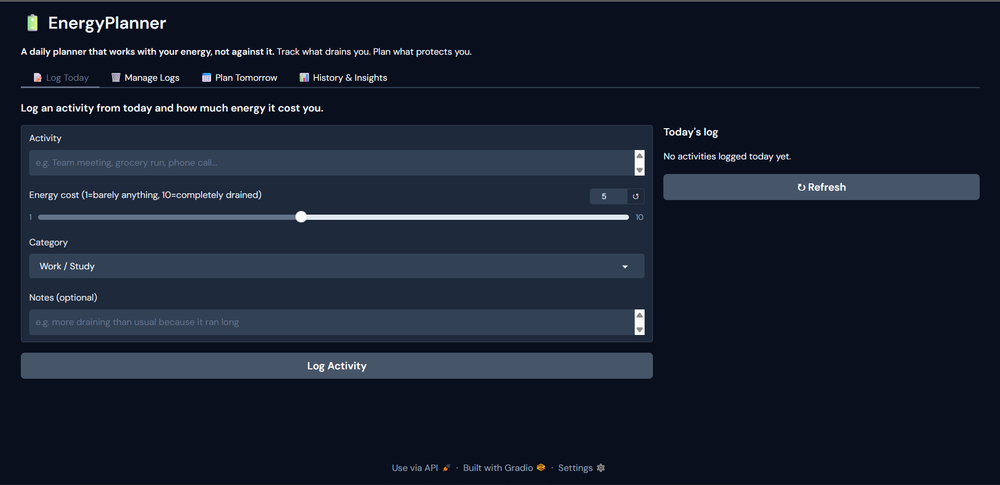
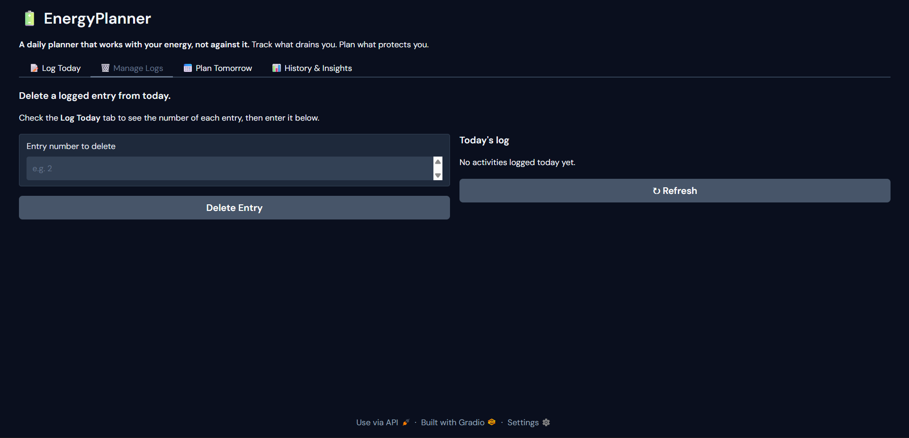
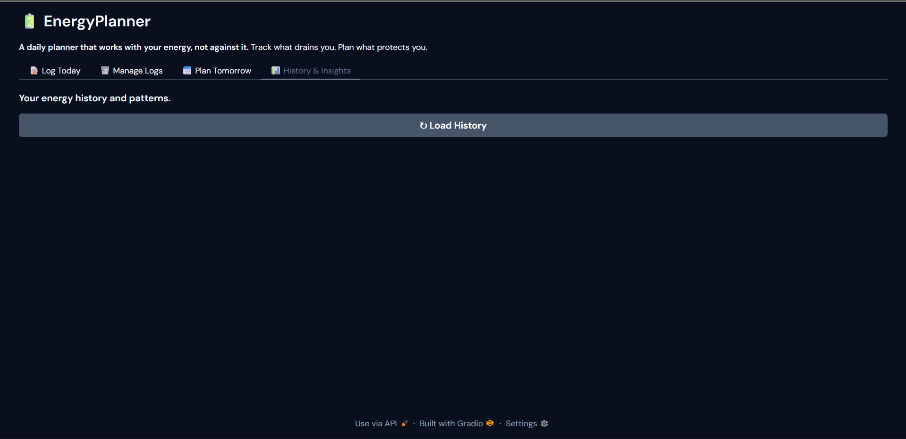

# 🔋 EnergyPlanner

A daily planning tool for autistic and sensory-sensitive people. You log what drained you today, and it builds tomorrow's plan around your actual energy.

---

## The problem it solves

Autistic and sensory-sensitive people often hit hard walls of exhaustion after demanding activities like social situations, noisy environments, unexpected changes. Standard planners ignore this completely. EnergyPlanner doesn't.

You rate each activity by how much it costs you (1-10). Over time it learns your patterns. When you plan the next day, it retrieves your own history to personalise the plan and it always builds in recovery buffers after high-cost activities.

---

## How it works

1. Log today's activities and rate the energy cost of each one
2. Build tomorrow's activity list with expected energy costs
3. The app retrieves similar past entries from your history using semantic search
4. A language model generates a calm, plain-language plan with recovery time built in
5. The plan is evaluated automatically and checking for overload risk and recovery mentions

---

## Tech stack

| Layer | Tool |
|---|---|
| Language model | Google Gemini 1.5 Flash |
| RAG / Vector search | FAISS + Sentence Transformers (`all-MiniLM-L6-v2`) |
| Data pipeline | Python, Pandas, JSON |
| Interface | Gradio |
| Environment | Google Colab |

---

## Screenshots

> Log today's activities and energy cost



> Manage and delete entries



> Build tomorrow's plan and generate it


> View your energy history and patterns



---

## Run it yourself

**1. Clone the repo**
```bash
git clone https://github.com/yourusername/energy-planner.git
cd energy-planner
```

**2. Install dependencies**
```bash
pip install -r requirements.txt
```

**3. Set your Gemini API key**

Get key at [aistudio.google.com](https://aistudio.google.com) 


```bash
export GEMINI_API_KEY="your-key-here"
```

**4. Run the app**
```bash
python app.py
```

---

## Project structure

```
energy-planner/
├── app.py                  # Main application
├── requirements.txt        # Dependencies
├── screenshots/            # UI screenshots
└── README.md
```

---

## Why I built this

This isn't a generic AI demo. It's built around a real, underserved need, the kind of daily planning support that doesn't exist anywhere else in this form. The design decisions (plain language, no overwhelm, mandatory recovery buffers, personal history as context) all come directly from understanding how energy works differently for autistic people.
